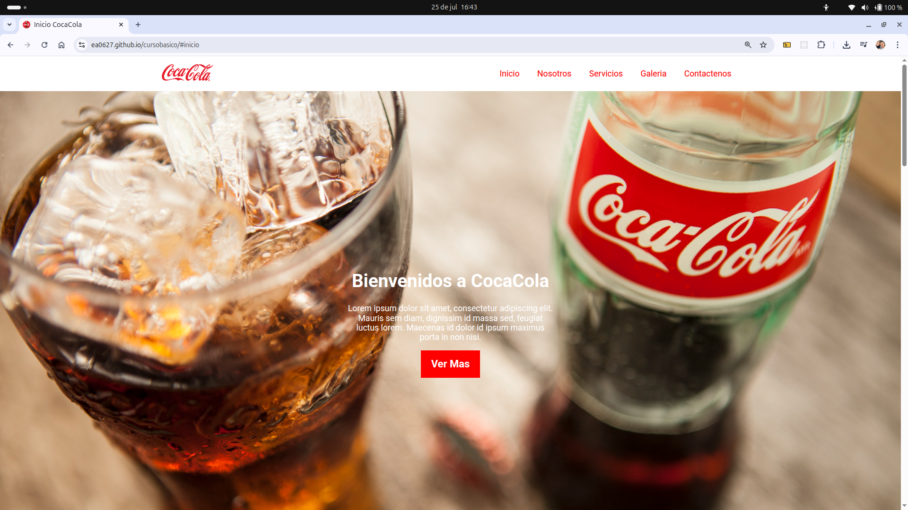

# 🥤 Página Web CocaCola – Curso Básico

Este proyecto fue desarrollado como parte de una práctica introductoria de HTML, CSS y JavaScript. Consiste en una página promocional de CocaCola con diseño limpio, responsive y algunos elementos interactivos para mejorar la experiencia del usuario.

---

## 🔗 Vista en vivo

👉 [Ver sitio en GitHub Pages](https://ea0627.github.io/cursobasico)

---

## ⚙️ Funcionalidades implementadas

- 🧱 Maquetación completa de una landing page estilo promocional.
- 🎨 Estilos personalizados con CSS para colores, tipografía y botones.
- 📱 Diseño adaptable a dispositivos móviles y tablets.
- ✨ Interactividad básica con JavaScript para botones o mensajes.

---

## 🛠️ Tecnologías usadas

- HTML5
- CSS3
- JavaScript (ES6)
- Git + GitHub Pages

---

## 📁 Estructura del Proyecto

```
cursobasico/
├── assets/              # Imágenes y recursos visuales
├── css/
│   └── style.css
├── js/
│   └── script.js
├── index.html
└── README.md
```

---

## 📸 Captura de pantalla



---

## 👨‍💻 Autor

**Eduardo Amaya**  
Desarrollador Web Junior  
Bootcamp TripleTen  

📬 eduardo.amaya627@gmail.com  
🔗 [GitHub @ea0627](https://github.com/ea0627)

---

## 📌 Notas adicionales

- Proyecto creado como parte del curso básico de desarrollo web.
- Ideal para practicar estructura HTML semántica, diseño CSS y primeros scripts en JavaScript.

---

> Gracias por revisar este proyecto. ¡Seguimos construyendo la web con creatividad! 🖥️🚀
